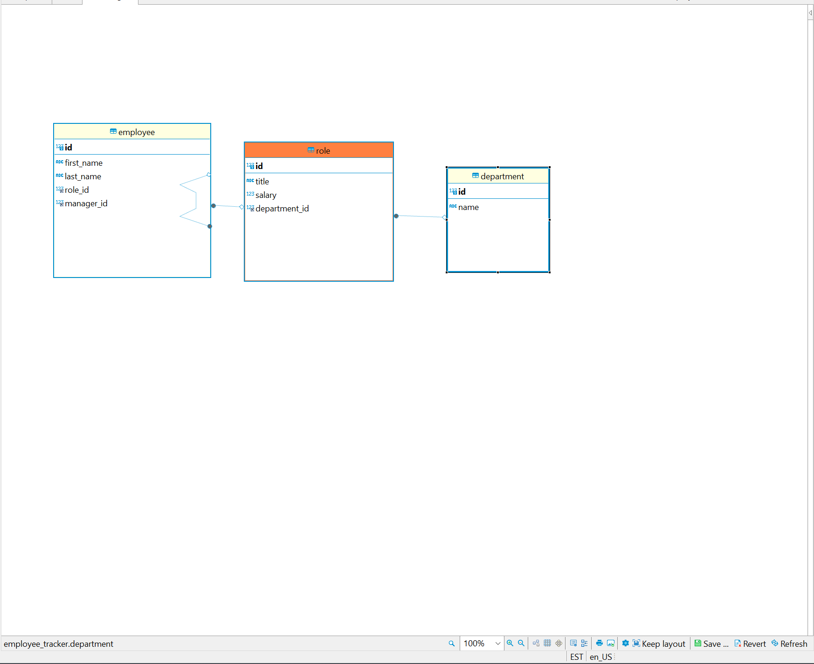

# Employee-Tracker

## Description
    This challenge was to create a employee tracker using MySQL. And i beleive we have done that. We go into our node and it does what it needs to do. You use it by entering node starter.js into the terminal and from there you pick where you want to go.
    

## Built with 
    - MySQl
    - Node js

## Project links.

## Sources.
    - Intsructors and tutors.
    - youtube.
    - NPM
    -Stackoverflow.

## Screenshot of database.

